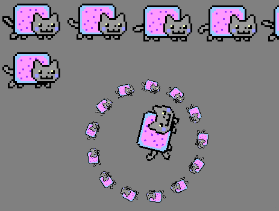

# sdl_nyan

Tiny SDL2-based library and demo application for rendering animated nyan cats.
Rainbows not included, cats only!

## Requirements and building

Requires CMake>=3.14, SDL2 and a c11/c++17 capable compiler.

    git clone https://github.com/oxmox42/sdl_nyan
    mkdir sdl_nyan/build && cd sdl_nyan/build/
    cmake .. &&  make
    ./sdl_nyan_demo

## Usage

Only internal use in the demo application tested so far. Needs more CMake-foo to
be installable as "proper" library.

The nyan sprites have been converted to c code and are included in the library,
so there's no need to keep the `.png` files around.

Create a `SDL_Renderer` and call `make_nyan_sprite_sheet_from_mem()`. This
creates a texture containing all 12 rightward-facing nyan sprites.

Use `nyan_sprite_rect()` to get the `SDL_Rect` for a specific sprite. This can
be used as the `sourceRect` for `SDL_RenderCopy` or `SDL_RenderCopyEx`.

See the demo on how to make circly, spinny nyans.

Meow!

## External projects used in sdl_nyan

* Nyan sprites taken from https://github.com/splitbrain/nyan which does not have a license.
* Uses stb_image from https://github.com/nothings/stb (MIT | public domain).
* [image_to_c](https://github.com/bitbank2/image_to_c) was used to generate C code from the nyan sprites.
